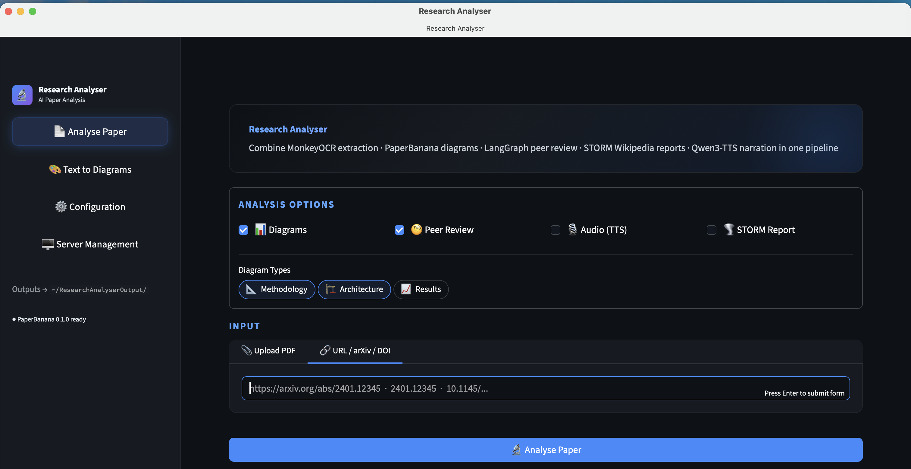

# Research Analyser

An AI-powered research paper analysis tool that combines **MonkeyOCR 1.5** for PDF extraction, **PaperBanana** for publication-quality diagram generation, **LangGraph Agentic Reviewer** for peer-review-quality analysis, **Qwen3-TTS** for audio narration, and **PaperReview.ai** comparison for external review benchmarking.

## Screenshot



## Features

- **PDF Upload & URL Input** — Upload PDFs, paste paper URLs (arXiv, Semantic Scholar, DOI), or type a local file path directly in the app window
- **Intelligent OCR Extraction** — MonkeyOCR 1.5 extracts text, equations (LaTeX), tables, and figures with state-of-the-art accuracy
- **AI Diagram Generation** — PaperBanana (Retriever → Planner → Stylist → Visualizer → Critic pipeline) generates methodology diagrams, architecture overviews, and results plots using Gemini VLM + Imagen; configurable refinement iterations, auto-refine, and input optimisation
- **Agentic Paper Review** — LangGraph 9-node workflow with ML-calibrated scoring (Soundness, Presentation, Contribution)
- **STORM Wikipedia Report** — Stanford OVAL's knowledge-storm generates a cited Wikipedia-style article about the paper's topic, grounded in the paper's own extracted content
- **PaperReview.ai Comparison** — Upload external review JSON from [PaperReview.ai](https://paperreview.ai) to compare scores against local review
- **Configuration Page** — Dedicated settings page for API keys (Google, OpenAI, Tavily, HuggingFace), model selection (OCR variant, review LLM, diagram provider + VLM/image model), PaperBanana refinement controls, STORM and TTS toggles, and output paths. PaperBanana installation status shown as a live badge.
- **Audio Narration** — Qwen3-TTS reads your analysis report aloud as a downloadable WAV file; offline model download built into the app
- **Structured Reports** — Markdown + HTML reports with key findings, equations, strengths/weaknesses, and visual summaries
- **Cross-platform Desktop App** — Standalone native-window bundles for macOS (DMG), Windows (EXE), and Linux (AppImage / DEB) via PyInstaller + pywebview

## Architecture

```
┌─────────────────────────────────────────────────────────┐
│                    Research Analyser                      │
├──────────┬──────────────┬───────────────┬───────────────┤
│  Input   │   Extraction │   Analysis    │    Output     │
│  Layer   │   Pipeline   │   Pipeline    │    Layer      │
├──────────┼──────────────┼───────────────┼───────────────┤
│ URL      │ MonkeyOCR    │ PaperBanana   │ Markdown      │
│ Fetcher  │ 1.5          │ Diagrams      │ Report        │
├──────────┼──────────────┼───────────────┼───────────────┤
│ PDF      │ Text/LaTeX   │ LangGraph     │ Key Points    │
│ Upload   │ Extraction   │ Reviewer      │ & Equations   │
├──────────┼──────────────┼───────────────┼───────────────┤
│ arXiv    │ Table/Figure │ PaperReview   │ Diagrams      │
│ Resolver │ Detection    │ Comparison    │ (PNG/SVG)     │
├──────────┼──────────────┼───────────────┼───────────────┤
│          │              │ Qwen3-TTS     │ Audio         │
│          │              │ Narration     │ (WAV)         │
└──────────┴──────────────┴───────────────┴───────────────┘
```

## Quick Start

### Prerequisites

- Python 3.12 (recommended; 3.10+ supported)
- CUDA-compatible GPU (for MonkeyOCR) or Apple Silicon / CPU fallback mode
- API keys: **Google Gemini** (required for PaperBanana diagrams), OpenAI (review), Tavily (optional, related work search)

### Installation

```bash
# Clone the repository
git clone https://github.com/kp-algomaster/Research_Analyser.git
cd Research_Analyser

# Create virtual environment (Python 3.12 recommended)
python3.12 -m venv .venv312
source .venv312/bin/activate

# Install dependencies
pip install -r requirements.txt

# Install MonkeyOCR
pip install monkeyocr

# Install PaperBanana — must be installed from GitHub (not on PyPI)
git clone https://github.com/llmsresearch/paperbanana.git /tmp/paperbanana
pip install -e '/tmp/paperbanana[dev,openai,google]'
# or directly via pip git syntax:
pip install 'paperbanana[dev,openai,google] @ git+https://github.com/llmsresearch/paperbanana.git'

# Download MonkeyOCR model weights
python -m monkeyocr.download --model MonkeyOCR-pro-3B

# Configure environment
cp .env.example .env
# Edit .env with your API keys:
#   GOOGLE_API_KEY=...   (required for PaperBanana diagram generation)
#   OPENAI_API_KEY=...   (required for agentic peer review)
#   TAVILY_API_KEY=...   (optional — enables related-work search during review)
#   HF_TOKEN=...         (optional — required only for Qwen3-TTS download)
```

> **PaperBanana note:** PaperBanana is **not published on PyPI**.  The `pip install paperbanana` command will not work.  Always install from the GitHub source using the command above.

### Run the Application

```bash
# CLI mode
python -m research_analyser analyse paper.pdf
python -m research_analyser analyse https://arxiv.org/abs/2401.12345

# Web UI mode (Streamlit)
streamlit run app.py

# API server mode
uvicorn research_analyser.api:app --host 0.0.0.0 --port 8000
```

---

## Distribution Builds

The app can be packaged as a self-contained native desktop application on all three platforms.  Each platform has a dedicated launcher (`packaging/<platform>_launcher.py`) and build script.  All builds produce a **native webview window** (no browser required) — macOS uses WKWebView, Windows uses Edge WebView2, Linux uses WebKit2GTK.

> **Common prerequisite:** create and populate the Python 3.12 virtual environment first (one-time setup):
> ```bash
> python3.12 -m venv .venv312
> source .venv312/bin/activate          # macOS/Linux
> .venv312\Scripts\Activate.ps1         # Windows (PowerShell)
> pip install -r requirements.txt
> pip install monkeyocr
> pip install 'paperbanana[dev,openai,google] @ git+https://github.com/llmsresearch/paperbanana.git'
> python -m monkeyocr.download --model MonkeyOCR-pro-3B
> ```

---

### macOS — DMG

**Build machine:** macOS 12 Monterey or later · Python 3.12 · Xcode Command Line Tools

```bash
# One command from the repo root
./scripts/build_macos_dmg.sh

# Outputs
dist/ResearchAnalyser.app   # Standalone .app bundle
dist/ResearchAnalyser.dmg   # Drag-and-drop disk image (~500 MB)
```

**What it produces:** A native macOS `.app` using `WKWebView` via pywebview.  The launcher is a lightweight ~153 MB bundle — all heavy ML dependencies (torch, MonkeyOCR, PaperBanana, …) are installed on first launch into `~/.researchanalyser/venv` and reused on subsequent launches.  Outputs go to `~/ResearchAnalyserOutput/`.  Launcher log at `~/ResearchAnalyserOutput/launcher.log`.

**Install:** Open `ResearchAnalyser.dmg`, drag the app to `/Applications`.

**API keys (required for diagram generation):**

The DMG app reads API keys from `~/.researchanalyser/.env` — create this file once:

```bash
mkdir -p ~/.researchanalyser
cat > ~/.researchanalyser/.env << 'EOF'
GOOGLE_API_KEY=your_google_api_key_here
OPENAI_API_KEY=your_openai_api_key_here
TAVILY_API_KEY=your_tavily_key_here
HF_TOKEN=your_huggingface_token_here
EOF
```

Keys can also be set per-session in the **Configuration** page of the app.

> **First launch:** macOS Gatekeeper may block an unsigned app.  Right-click → Open, then confirm.  The first launch installs all ML dependencies (~5–15 min depending on network speed).

---

### Windows — EXE

**Build machine:** Windows 10/11 · Python 3.12 · PowerShell 5+

#### Prerequisites

1. Install [Python 3.12](https://python.org/downloads) (check *Add to PATH*).
2. Install [Microsoft Edge WebView2 Runtime](https://developer.microsoft.com/en-us/microsoft-edge/webview2/) (already present on Windows 11 and most Windows 10 systems).
3. Create and populate the venv (see common prerequisite above, use PowerShell paths).

#### Build

```powershell
# From repo root in PowerShell
.\scripts\build_windows_exe.ps1

# Outputs
dist\ResearchAnalyser\ResearchAnalyser.exe   # Portable executable + dependencies
dist\ResearchAnalyser-Windows.zip            # Distributable archive (~500 MB)
```

**What it produces:** A portable folder — zip it up and distribute.  The `.exe` opens a native Edge WebView2 window.  Outputs go to `%USERPROFILE%\ResearchAnalyserOutput\`.

**Install (end user):** Extract the ZIP anywhere, double-click `ResearchAnalyser.exe`.

#### Optional: NSIS installer

For a proper installer wizard (`ResearchAnalyserSetup.exe`):

1. Install [NSIS](https://nsis.sourceforge.io/Download).
2. Run `makensis packaging\installer.nsi` after the build script completes.

> **Antivirus false positives:** PyInstaller-packed executables are sometimes flagged.  Sign the `.exe` with a code-signing certificate to avoid this in production.

---

### Linux — AppImage / DEB

**Build machine:** Ubuntu 22.04+ or Fedora 38+ · Python 3.12

#### Prerequisites

```bash
# Debian/Ubuntu
sudo apt install python3.12 python3.12-venv python3.12-dev \
                 gir1.2-webkit2-4.0 python3-gi

# Fedora/RHEL
sudo dnf install python3.12 python3.12-devel \
                 webkit2gtk4.0 python3-gobject
```

For `.AppImage` output, install `appimagetool`:

```bash
wget https://github.com/AppImage/AppImageKit/releases/latest/download/appimagetool-x86_64.AppImage
chmod +x appimagetool-x86_64.AppImage
sudo mv appimagetool-x86_64.AppImage /usr/local/bin/appimagetool
```

For `.deb` output, install `fpm`:

```bash
sudo apt install ruby-dev build-essential
sudo gem install fpm
```

#### Build

```bash
# Raw bundle only (fastest)
./scripts/build_linux_package.sh

# Bundle + AppImage
./scripts/build_linux_package.sh --appimage

# Bundle + .deb package
./scripts/build_linux_package.sh --deb

# All outputs
./scripts/build_linux_package.sh --all

# Outputs
dist/ResearchAnalyser/ResearchAnalyser       # Portable binary + dependencies
dist/ResearchAnalyser.AppImage               # Self-contained (--appimage)
dist/ResearchAnalyser_1.0.0_amd64.deb        # Debian installer  (--deb)
```

**What it produces:**
- **AppImage** — runs on any modern Linux distribution without installation; double-click or `chmod +x ResearchAnalyser.AppImage && ./ResearchAnalyser.AppImage`.  Tries native WebKit2GTK window first; falls back to `xdg-open` (default browser) automatically if the GTK webview is unavailable.
- **.deb** — installs to `/opt/ResearchAnalyser/` with a `.desktop` entry; requires `gir1.2-webkit2-4.0` as a system dependency.

**Install (end user, AppImage):**

```bash
chmod +x ResearchAnalyser.AppImage
./ResearchAnalyser.AppImage
```

**Install (end user, .deb):**

```bash
sudo dpkg -i ResearchAnalyser_1.0.0_amd64.deb
sudo apt install -f          # resolve any missing system dependencies
```

> **WebKit system dependency:** The native webview window requires `webkit2gtk` on the *target* machine (not bundled).  If absent, the app opens in the default browser instead — full functionality is preserved.

---

### Build artefact sizes (approximate)

| Platform | Format | Launcher size | After first-launch install |
|----------|--------|--------------|---------------------------|
| macOS | `.dmg` | ~153 MB | ~3–5 GB in `~/.researchanalyser/venv` |
| Windows | `.zip` | ~450 MB | — |
| Linux | `.AppImage` | ~480 MB | — |

The macOS DMG is kept small (~153 MB) because heavy ML dependencies (PyTorch, MonkeyOCR, PaperBanana) are installed on first launch into the companion venv rather than bundled.

---

## Usage Examples

### CLI

```bash
# Analyse with diagrams and review
python -m research_analyser analyse https://arxiv.org/abs/2602.17002

# Diagrams only (no review)
python -m research_analyser analyse paper.pdf --diagrams --no-review -d methodology

# Review only (no diagrams)
python -m research_analyser analyse paper.pdf --no-diagrams --review

# With audio narration (Qwen3-TTS)
python -m research_analyser analyse paper.pdf --audio
python -m research_analyser analyse paper.pdf --no-diagrams --no-review --audio

# With STORM Wikipedia-style report (requires: pip install knowledge-storm, storm.enabled: true in config.yaml)
python -m research_analyser analyse paper.pdf --storm
```

### Web UI

The Streamlit UI has three pages (navigation in the left sidebar):

| Page | What it does |
|------|-------------|
| **Analyse Paper** | Upload a PDF, enter an arXiv/DOI URL, or paste a local file path. Choose per-run options (diagrams, peer review, audio narration, STORM report), select diagram types (Methodology / Architecture / Results), click **Analyse Paper** |
| **Configuration** | Set API keys (Google, OpenAI, Tavily, HuggingFace); choose OCR variant, review LLM, diagram LLM provider, VLM model, image model; configure PaperBanana refinement iterations, auto-refine, and input optimisation; enable STORM / TTS; set output paths. PaperBanana installation status shown live. Keys persist to the session; for permanent storage use `~/.researchanalyser/.env`. |
| **Server Management** | Start/stop the FastAPI backend, inspect connection status and device badges |

### Python API

```python
import asyncio
from research_analyser.analyser import ResearchAnalyser
from research_analyser.models import AnalysisOptions

analyser = ResearchAnalyser()
options = AnalysisOptions(generate_diagrams=True, generate_review=True)
report = asyncio.run(analyser.analyse("https://arxiv.org/abs/2602.17002", options=options))

print(report.summary.one_sentence)
print(f"Review score: {report.review.overall_score:.1f}/10")

# Generate with STORM Wikipedia-style report (set storm.enabled: true in config.yaml first)
options = AnalysisOptions(generate_storm_report=True)
report = asyncio.run(analyser.analyse("paper.pdf", options=options))
print(report.storm_report)  # Full Wikipedia-style article
# Also saved to output/storm_report.md

# Generate with audio narration
options = AnalysisOptions(generate_audio=True)
report = asyncio.run(analyser.analyse("paper.pdf", options=options))
# Audio saved to output/analysis_audio.wav
```

### PaperReview.ai Comparison

Upload external review JSON with this format:
```json
{
  "overall_score": 6.9,
  "soundness": 3.1,
  "presentation": 3.0,
  "contribution": 3.2,
  "confidence": 3.5
}
```

## Review Scoring Formula

$$\text{score} = -0.3057 + 0.7134 \times S + 0.4242 \times P + 1.0588 \times C$$

Where $S$ = Soundness, $P$ = Presentation, $C$ = Contribution (each on 1–4 scale). Output maps to 1–10 overall score.

## Output Structure

```
output/
├── report.md                    # Full analysis report
├── key_points.md                # Extracted key points & equations
├── spec_output.md               # Machine-readable spec-driven output
├── report.html                  # HTML report with MathJax equations
├── review.md                    # Peer review analysis
├── storm_report.md              # STORM Wikipedia-style article (optional)
├── diagrams/
│   ├── methodology.png          # Methodology overview diagram
│   ├── architecture.png         # Architecture diagram
│   └── results_plot.png         # Results visualization
├── analysis_audio.wav           # Audio narration (Qwen3-TTS, optional)
├── extracted/
│   ├── full_text.md             # Complete extracted text
│   ├── equations.json           # All equations in LaTeX
│   └── tables.json              # Extracted tables
└── metadata.json                # Paper metadata & analysis config
```

## Configuration

See [docs/configuration.md](docs/configuration.md) for full configuration options.

## GitHub Repositories (Dependencies)

| Tool | Repository | Purpose |
|------|-----------|---------|
| MonkeyOCR 1.5 | [Yuliang-Liu/MonkeyOCR](https://github.com/Yuliang-Liu/MonkeyOCR) | PDF/document content extraction |
| PaperBanana | [llmsresearch/paperbanana](https://github.com/llmsresearch/paperbanana) | AI diagram generation |
| PaperBanana (Official) | [dwzhu-pku/PaperBanana](https://github.com/dwzhu-pku/PaperBanana) | Original research implementation |
| Agentic Paper Review | [debashis1983/agentic-paper-review](https://github.com/debashis1983/agentic-paper-review) | Open-source paper reviewer |
| Qwen3-TTS | [QwenLM/Qwen3-TTS](https://huggingface.co/Qwen/Qwen3-TTS) | Text-to-speech audio narration |
| PaperReview.ai | [paperreview.ai](https://paperreview.ai/) | Stanford Agentic Reviewer (web) |

## License

MIT License - see [LICENSE](LICENSE) for details.
